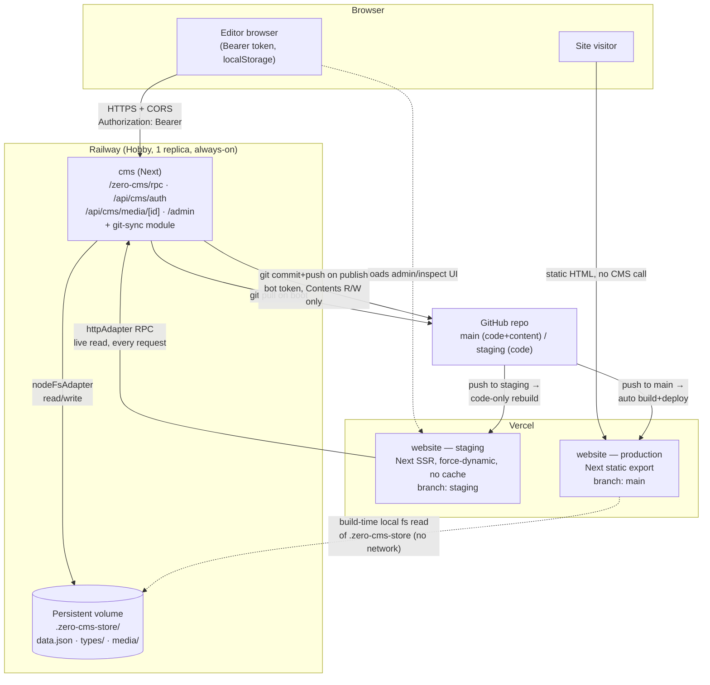
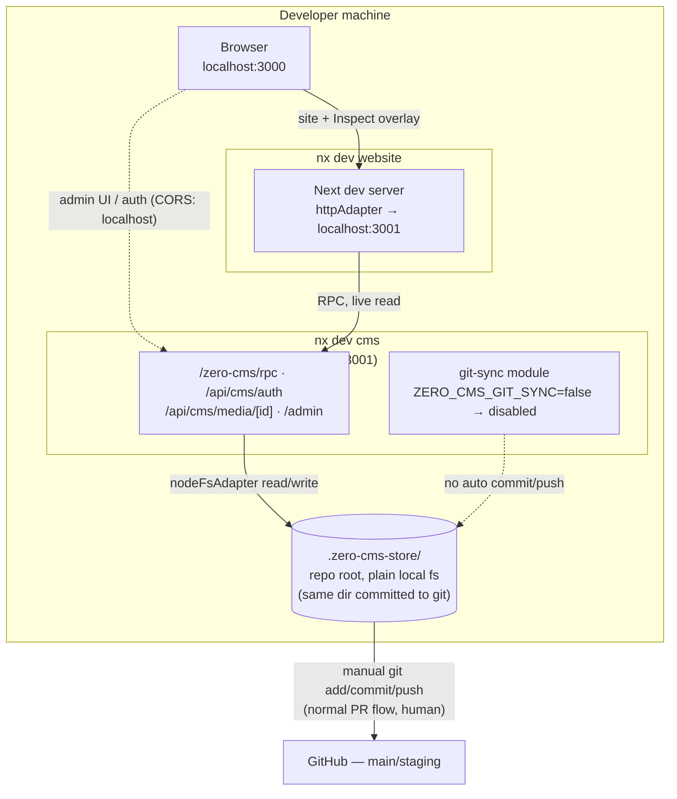

This is a [Next.js](https://nextjs.org) project bootstrapped with [`create-next-app`](https://nextjs.org/docs/app/api-reference/cli/create-next-app).

## Architecture

Content editing is split from the public site so `website` production can stay a static
export while edits still happen live. `cms` (Railway, always-on, single writer) owns
the zero-cms store, auth, and the RPC surface; it commits + pushes published changes to
`main`, which is the only thing production's static build depends on.



Local dev mirrors the same two-process shape, minus the git-sync push:



See [ADR 0003](./docs/adr/0003-zero-cms-filesystem-store.md) and
[ADR 0004](./docs/adr/0004-zero-cms-pluggable-adapter.md) for the design constraints this
topology satisfies (single writer, pluggable adapter). Deploying `cms` itself
(Railway service setup, git-sync credentials, secrets) is a manual/infra runbook,
not code — see [`docs/cms-railway.md`](./docs/cms-railway.md).

## Environment setup

Website env vars live in a **single root file** — no per-app duplication.

1. **Install [direnv](https://direnv.net/)** and hook it into your shell ([setup guide](https://direnv.net/docs/hook.html)).
2. **Create secrets file** at the repo root:
   ```bash
   cp .env.example .env.local
   ```
   Edit `.env.local` and fill in `STRAPI_API_TOKEN` and any other values.
3. **Allow direnv** (once per machine):
   ```bash
   direnv allow          # repo root — loads .env.local via .envrc
   cd apps/website && direnv allow   # inherits root via source_up
   ```
4. **Run the website** from the repo root:
   ```bash
   npm run dev
   ```

### How it works

| File | Purpose |
| ---- | ------- |
| `.env.example` | Committed template — copy to `.env.local` |
| `.env.local` | Your secrets (gitignored) |
| `.envrc` | Root direnv loader: `dotenv .env.local` |
| `apps/website/.envrc` | `source_up` — walks up to root `.envrc` |

When you `cd` into `apps/website`, direnv loads the same vars as at the repo root. Next.js, codegen, and Nx scripts all read `process.env` from the shell.

`apps/cms` (zero-cms) reads the same root `.env.local` as `website` — no per-app duplication there either.

### zero-cms local dev: two modes

- **Default (simplest):** `npm run dev` — just `website`, reading `.zero-cms-store/` directly
  off local disk. No `cms` process needed. Leave `ZERO_CMS_REMOTE_URL` unset.
- **Full topology:** `npm run dev:all` — runs `website` (:3000) + `cms` (:3001) together,
  matching staging's real shape (`website` talks to `cms` over `httpAdapter`). Set
  `ZERO_CMS_REMOTE_URL`/`NEXT_PUBLIC_ZERO_CMS_URL=http://localhost:3001` and
  `ZERO_CMS_ALLOWED_ORIGINS=http://localhost:3000` in `.env.local`, plus a dedicated
  **viewer-role** service account on `cms` (log into `http://localhost:3001/admin`
  with the seeded `ZERO_CMS_ADMIN_EMAIL`/`PASSWORD`, create a viewer user, put its
  credentials in `.env.local` as `ZERO_CMS_SERVICE_EMAIL`/`PASSWORD`). Worth doing before
  shipping any change that touches the zero-cms integration itself — see root README ->
  Architecture.

`ZERO_CMS_GIT_SYNC` should stay unset/`false` locally — it auto-pushes published content
to `main` and is meant for the Railway deployment only.

## CMS data transfer

```bash
npm run cms:push    # LOCAL  → CLOUD
npm run cms:pull    # CLOUD  → LOCAL
```

> [!WARNING]
> These do a **full, destructive database mirror** — not a content-only sync. Each run overwrites
> the target with the source, including **admin users/roles, U&P roles, webhooks, and auth
> providers**. No merge, no undo. See [`docs/cms-transfer.md`](docs/cms-transfer.md) for exactly
> what moves and the footguns (admin lockout, wiped webhooks, traveling secrets).

## Getting Started

First, run the development server:

```bash
npm run dev
# or
yarn dev
# or
pnpm dev
# or
bun dev
```

Open [http://localhost:3000](http://localhost:3000) with your browser to see the result.

You can start editing the page by modifying `app/page.tsx`. The page auto-updates as you edit the file.

This project uses [`next/font`](https://nextjs.org/docs/app/building-your-application/optimizing/fonts) to automatically optimize and load [Geist](https://vercel.com/font), a new font family for Vercel.

## Learn More

To learn more about Next.js, take a look at the following resources:

- [Next.js Documentation](https://nextjs.org/docs) - learn about Next.js features and API.
- [Learn Next.js](https://nextjs.org/learn) - an interactive Next.js tutorial.

You can check out [the Next.js GitHub repository](https://github.com/vercel/next.js) - your feedback and contributions are welcome!

## Deploy on Vercel

The easiest way to deploy your Next.js app is to use the [Vercel Platform](https://vercel.com/new?utm_medium=default-template&filter=next.js&utm_source=create-next-app&utm_campaign=create-next-app-readme) from the creators of Next.js.

Check out our [Next.js deployment documentation](https://nextjs.org/docs/app/building-your-application/deploying) for more details.
