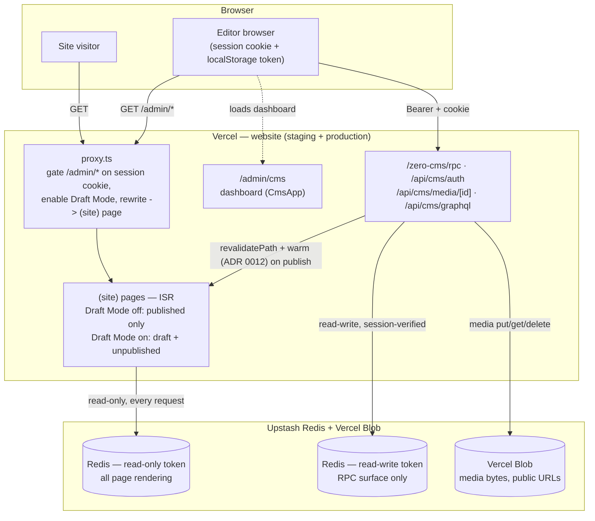

This is a [Next.js](https://nextjs.org) project bootstrapped with [`create-next-app`](https://nextjs.org/docs/app/api-reference/cli/create-next-app).

## Architecture

One Next.js app (`website`) serves both the public site and the zero-cms editor —
there's no separate CMS process, no persistent volume, no git-sync. Content lives in
Upstash Redis (schema + entries + users, per-record keys with optimistic concurrency)
and Vercel Blob (media bytes) — see [ADR 0008](./docs/adr/0008-zero-cms-redis-blob-store.md)
/ [ADR 0009](./docs/adr/0009-zero-cms-multi-writer-optimistic-concurrency.md). Production
uses **ISR**, not a static export — publishing calls `revalidatePath("/", "layout")`
inline, in the same request, no webhook — see
[ADR 0010](./docs/adr/0010-vercel-only-deployment-isr.md). That invalidation is
whole-site but lazy on its own — the RPC response also kicks off a background pass
(via `after()`) that self-fetches every route so the Full Route Cache is warm again
before a real visitor's request, instead of the first one after publish paying a
cold render — see [ADR 0012](./docs/adr/0012-eager-cache-warming-after-publish.md).

Editing happens at `/admin/*`, which **Proxy** (`src/proxy.ts`, Next 16's renamed
Middleware) gates on a session cookie and rewrites to the exact same public pages —
in Draft Mode, so they render draft/unpublished content instead. `/admin/cms` is the
one real distinct route: the dashboard app (Types, Entries, Media, Users).



Local dev is the same shape, one process: `npm run dev` runs `website` against the
same live Redis + Blob as staging/production (no local-only mode — see
`.env.local`).

## Services & subscriptions

Everything external the site depends on, and what it costs. Prices checked July 2026 —
re-verify before budgeting ([Vercel](https://vercel.com/pricing),
[Upstash](https://upstash.com/pricing/redis), [Porkbun](https://porkbun.com/tld/contractors),
[Google Workspace](https://workspace.google.com/pricing),
[GizmoSauce](https://gizmosauce.com/pricing), [Trustpilot](https://business.trustpilot.com/pricing)).

| Service | What it does | Cost |
| ------- | ------------ | ---- |
| **Vercel** (Pro) | Hosts the website — production + staging, ISR, serverless RPC. Paid plan required for commercial use. | $20/user/mo (1 seat), includes $20/mo usage credit |
| **Upstash Redis** (via Vercel Marketplace) | The CMS database — schema, all content entries, CMS user accounts ([ADR 0008](./docs/adr/0008-zero-cms-redis-blob-store.md)). | $0 on free tier (256 MB, 500K commands/mo); then pay-as-you-go $0.20 / 100K commands |
| **Vercel Blob** | All CMS media bytes (photos, files), CDN-served. | Usage-billed ($0.023/GB stored + per-op); covered by Pro's included credit at current volume |
| **Domain** | `upperstreet.contractors` registration. | ≈ $28/yr renewal (≈ $2.40/mo) |
| **Email** | Enquiry-form delivery (nodemailer SMTP). Free Gmail app-password today; production wants `info@upperstreet.contractors`. | $0 now → Google Workspace Business Starter **£5/user/mo** (annual, + VAT) when `info@` goes live |
| **GizmoSauce** | The Google Reviews widget embedded on the site. | $8.25/mo (Starter, 5 widgets — we use 1); ≈ $5.78/mo billed yearly (30% off) |
| **Trustpilot** | TrustBox review widget + profile. | $0 — free business plan is enough (50 invites/mo, widget, replies) |

**Totals**

| Scenario | Monthly | Yearly |
| -------- | ------- | ------ |
| Today (Gmail email, monthly billing) | ≈ **$30.65** | ≈ $368 |
| Today, GizmoSauce billed yearly | ≈ $28.18 | ≈ $338 |
| With `info@` mailbox (Workspace Starter) | + £5 + VAT | + £60 + VAT |
| **Overall, everything on (incl. `info@` + VAT)** | ≈ **$38 / £30** | ≈ **$455 / £355** |

Overall row assumes ≈ $1.30/£ (re-check FX) and Workspace VAT included (reclaimable if
VAT-registered). Vercel usage staying inside Pro's included credit and Redis inside the
free tier — both true at current traffic/content scale.

Not subscriptions: fonts (self-hosted), WhatsApp links, Google Business Profile, analytics (none used).

## Environment setup

Env vars live in a **single root file** — one app, no per-app duplication.

1. **Install [direnv](https://direnv.net/)** and hook it into your shell ([setup guide](https://direnv.net/docs/hook.html)).
2. **Create secrets file** at the repo root:
   ```bash
   cp .env.example .env.local
   ```
   Fill in the Upstash Redis + Vercel Blob values (Vercel Marketplace → Storage tab
   on the project — see `docs/agents/project-stack.md` → Environment variables) and
   `ZERO_CMS_AUTH_SECRET`.
3. **Allow direnv** (once per machine):
   ```bash
   direnv allow          # repo root — loads .env.local via .envrc
   ```
4. **Run the app** from the repo root:
   ```bash
   npm run dev
   ```

### How it works

| File | Purpose |
| ---- | ------- |
| `.env.example` | Committed template — copy to `.env.local` |
| `.env.local` | Your secrets (gitignored) |
| `.envrc` | direnv loader: `dotenv .env.local` |

Next.js, codegen, and Nx scripts all read `process.env` from the shell.

Local dev talks to the **same live Redis + Blob** as staging/production — there's no
local-only storage mode (ADR 0008 dropped the filesystem store `website` used to read
directly). `npm run dev` is the only entrypoint; there's nothing else to run alongside it.

## Getting Started

First, run the development server:

```bash
npm run dev
# or
yarn dev
# or
pnpm dev
# or
bun dev
```

Open [http://localhost:3000](http://localhost:3000) with your browser to see the result.

You can start editing the page by modifying `app/page.tsx`. The page auto-updates as you edit the file.

This project uses [`next/font`](https://nextjs.org/docs/app/building-your-application/optimizing/fonts) to automatically optimize and load [Geist](https://vercel.com/font), a new font family for Vercel.

## Learn More

To learn more about Next.js, take a look at the following resources:

- [Next.js Documentation](https://nextjs.org/docs) - learn about Next.js features and API.
- [Learn Next.js](https://nextjs.org/learn) - an interactive Next.js tutorial.

You can check out [the Next.js GitHub repository](https://github.com/vercel/next.js) - your feedback and contributions are welcome!

## Deploy on Vercel

The easiest way to deploy your Next.js app is to use the [Vercel Platform](https://vercel.com/new?utm_medium=default-template&filter=next.js&utm_source=create-next-app&utm_campaign=create-next-app-readme) from the creators of Next.js.

Check out our [Next.js deployment documentation](https://nextjs.org/docs/app/building-your-application/deploying) for more details.
