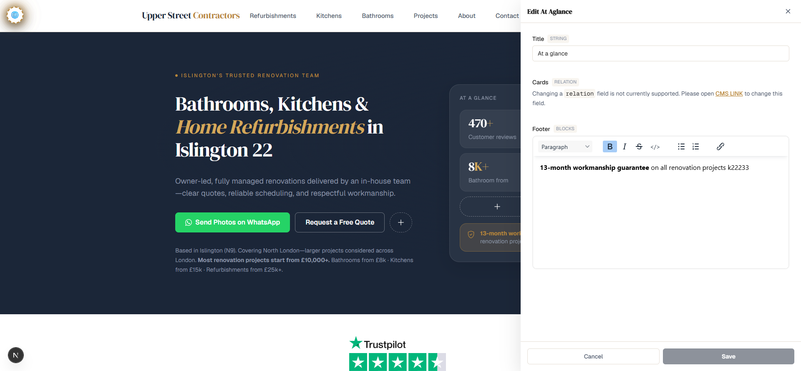
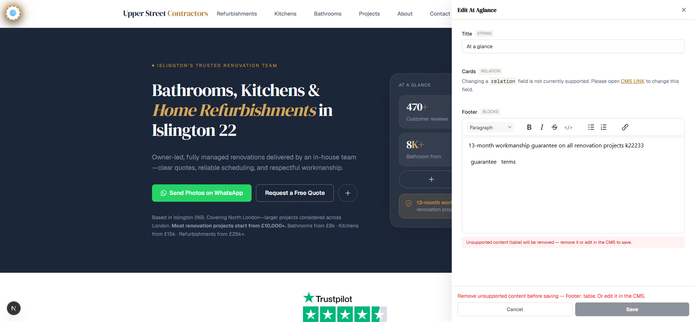
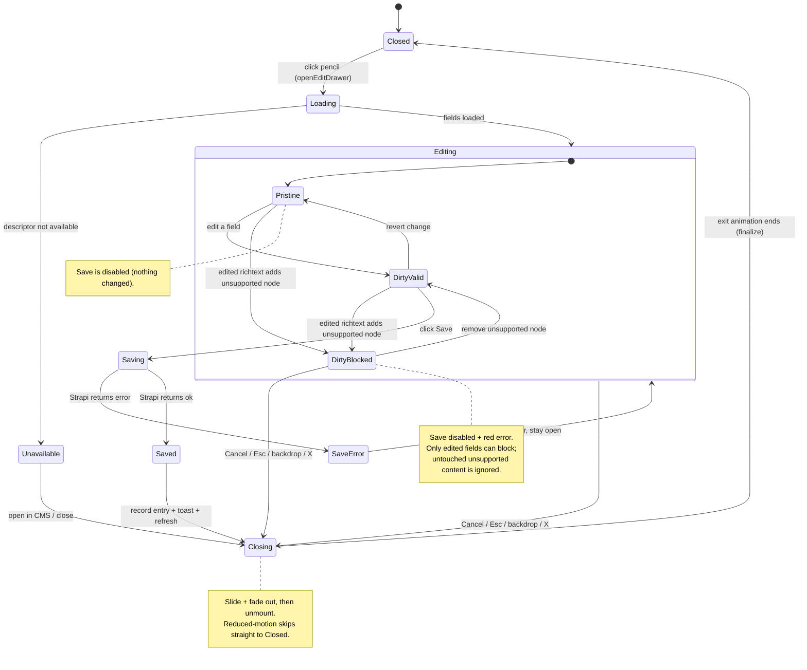
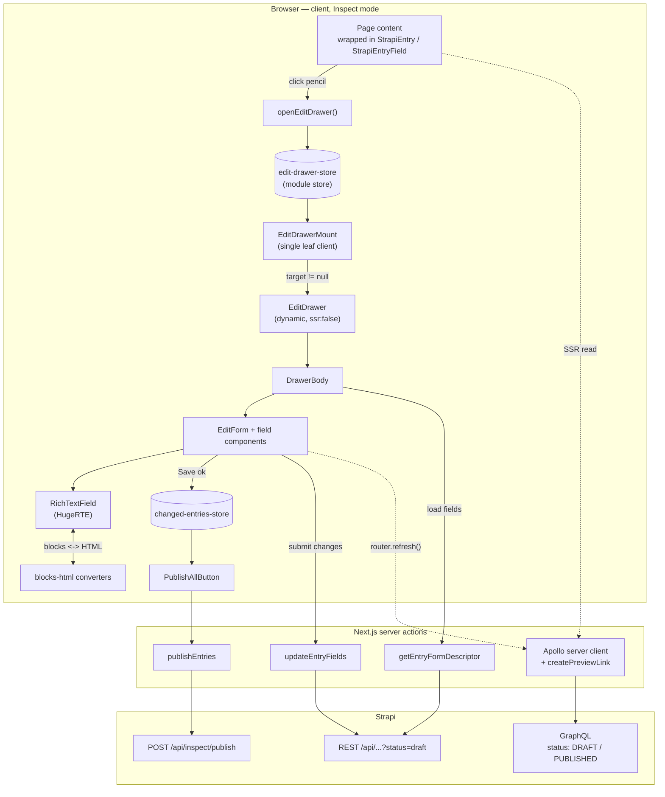

# Edit drawer — content editing flow

How content gets edited **in-page** when [Inspect mode](../../CONTEXT.md#inspect-mode) is on
(`?inspect=true`). The Edit drawer reads a Strapi entry, lets you change its fields,
saves them back as a **draft**, and (optionally) publishes them.

This doc is a map: plain steps first, then a state diagram of every case, then the
architecture, then a table pointing at the exact file behind each step.

---

## The flow in plain steps

1. **Turn on Inspect mode** (`?inspect=true`). Every wrapped **Entry** and **Field** gets a
   hover outline and an edit pencil.
2. **Click a pencil.** An Entry pencil opens the whole entry; a Field pencil opens the same
   entry with that one field focused (dashed glowing border). The click records *which* entry
   to edit in a small module store.
3. **The drawer slides in** from the right (capped at 35% of the screen on desktop, full-width
   on mobile) and shows a skeleton while it loads.
4. **It fetches the entry's fields** — a server action reads the content-type schema and pulls
   the current **draft** values straight from Strapi.
5. **Each field renders by type:** text, number, boolean, richtext (a locked-down HugeRTE
   editor), or — for anything the drawer can't edit inline — an *"open in CMS"* message.
6. **You edit.** The drawer compares every field against its original value, so **Save only
   enables once something actually changed**.
7. **Guard rail for richtext:** if you edit a richtext field and add content the converter
   can't store (e.g. a pasted **table** or **image**), **Save is blocked** and a red error
   names the field. Remove it — or edit it in the CMS — to continue. Pre-existing unsupported
   content in a field you *didn't* touch never blocks you.
8. **Click Save.** Changed fields are converted (richtext HTML → Strapi blocks) and written to
   Strapi as a **draft**. A toast confirms, the page refreshes, and the drawer **slides out**.
9. **The change is remembered** for this browser session, and a green **"Publish all changes"**
   button appears bottom-center.
10. **Click "Publish all changes"** to push every changed draft live (draft → published).

> What the public page actually *shows* (draft vs published) is a **separate** switch —
> [Preview mode](#preview-mode--draft-vs-published) below.

### The drawer, open

*Title is an editable text field. Cards is a relation, so it shows the "not currently
supported — open in CMS" message. Footer is a richtext field in the HugeRTE editor.*

### Save blocked on unsupported richtext (step 7)

*A table was added to the Footer richtext. Two errors appear — one under the editor, one in the
footer — and **Save is disabled** until the unsupported content is removed.*

---

## State diagram — every case of a change

**Reading the cases:**

| Case | What you did | Result |
|---|---|---|
| **Pristine** | Opened, no edits | Save disabled |
| **DirtyValid** | Changed a supported field | Save enabled |
| **DirtyBlocked** | Edited richtext now holds an unsupported node | Save disabled + red error naming the field |
| **SaveError** | Saved but Strapi rejected it | Error shown, drawer stays open, you can retry |
| **Saved** | Save succeeded | Draft written, toast, page refresh, drawer closes, entry queued for publish |
| **Unavailable** | Entry type/schema can't be edited inline | "Open in CMS" link only |
| **Closing** | Cancel / Esc / backdrop / X | Drawer slides out, then unmounts |

---

## Architecture

**Why a module store, not React Context:** the store
([`edit-drawer-store.ts`](../../apps/website/src/components/edit-drawer/edit-drawer-store.ts))
is a plain module with `useSyncExternalStore`, and the drawer mounts as a **single leaf
client** ([`edit-drawer-mount.tsx`](../../apps/website/src/components/edit-drawer/edit-drawer-mount.tsx)).
Nothing wraps the app tree in `"use client"`, so the page stays server-rendered.

---

## Code reference — step → file

| Step | What the code does | File(s) |
|---|---|---|
| Show pencils on entries/fields | Hover outline + edit button in Inspect mode | [`strapi-entry.tsx`](../../apps/website/src/components/strapi/strapi-entry.tsx), [`strapi-entry-field.tsx`](../../apps/website/src/components/strapi/strapi-entry-field.tsx) |
| Open the drawer | Pencil click sets the target entry/field | `openEditDrawer` in [`edit-drawer-store.ts`](../../apps/website/src/components/edit-drawer/edit-drawer-store.ts) |
| Mount only when needed | Renders `EditDrawer` only while a target is set | [`edit-drawer-mount.tsx`](../../apps/website/src/components/edit-drawer/edit-drawer-mount.tsx) |
| Slide in / slide out | Enter + exit animation, focus trap, Esc, scroll lock | [`edit-drawer.tsx`](../../apps/website/src/components/edit-drawer/edit-drawer.tsx) (`closing` / `finalize`), keyframes in [`globals.css`](../../apps/website/src/app/globals.css) |
| Load the fields | Reads schema + fetches the draft entry | `getEntryFormDescriptor` in [`actions.ts`](../../apps/website/src/lib/entry-editor/actions.ts), [`read-schema.ts`](../../apps/website/src/lib/entry-editor/read-schema.ts) |
| Render each field by type | text / number / boolean / richtext / unsupported | [`edit-form.tsx`](../../apps/website/src/components/edit-drawer/edit-form.tsx), [`fields/`](../../apps/website/src/components/edit-drawer/fields/) |
| Richtext editing + conversion | HugeRTE editor; blocks ⇄ HTML | [`fields/rich-text-field.tsx`](../../apps/website/src/components/edit-drawer/fields/rich-text-field.tsx), [`blocks-html.ts`](../../apps/website/src/lib/entry-editor/blocks-html.ts) |
| Detect "changed" + block Save | `fieldChanged`, `isDirty`, `richtextIssues` → `blockSave` | [`edit-form.tsx`](../../apps/website/src/components/edit-drawer/edit-form.tsx) (`isDirty` ~L91, `blockSave` ~L100–114, `onSubmit` ~L116) |
| Per-field unsupported warning | Inline red error only when *that field* is edited + has dropped nodes | [`fields/rich-text-field.tsx`](../../apps/website/src/components/edit-drawer/fields/rich-text-field.tsx) (`changed && dropped.length`) |
| Save the draft | `PUT /api/...?status=draft` | `updateEntryFields` in [`actions.ts`](../../apps/website/src/lib/entry-editor/actions.ts) |
| Remember + publish changes | Track edited entries, then one-click publish | [`changed-entries-store.ts`](../../apps/website/src/components/edit-drawer/changed-entries-store.ts), [`publish-all-button.tsx`](../../apps/website/src/components/edit-drawer/publish-all-button.tsx), `publishEntries` in [`actions.ts`](../../apps/website/src/lib/entry-editor/actions.ts) |

---

## Preview mode — draft vs published

Editing always writes **drafts**. What the *public* site renders is controlled by the
`ENABLE_PREVIEW` env flag, injected once for every server read:

- `ENABLE_PREVIEW=true` → every server GraphQL read requests `status: DRAFT` → the whole site
  shows draft content.
- `ENABLE_PREVIEW=false` (default) → `status: PUBLISHED` only.

It's wired in one place — `createPreviewLink`
([`apollo-preview-link.ts`](../../apps/website/src/lib/apollo-preview-link.ts)) added to the
Apollo link chain in
[`apollo-server.ts`](../../apps/website/src/lib/apollo-server.ts) — so no query call site
passes the variable itself. The value comes from `withPreviewVariables`
([`preview-utils.ts`](../../apps/website/src/helpers/preview-utils.ts)).

> `ENABLE_PREVIEW` is read at **server start** — changing it needs a dev-server restart.

---

## Related

- ADR 0001 — [richtext HugeRTE ↔ blocks conversion](../adr/0001-richtext-hugerte-blocks-conversion.md)
- ADR 0002 — [inspect publish custom route](../adr/0002-inspect-publish-custom-route.md)
- Glossary — [`CONTEXT.md`](../../CONTEXT.md) (Inspect mode, Preview mode, Entry, Field, Edit drawer, …)
